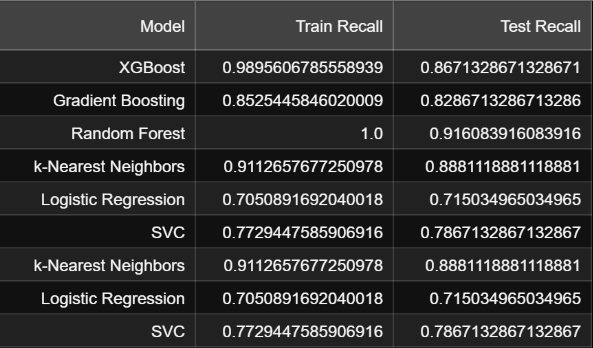
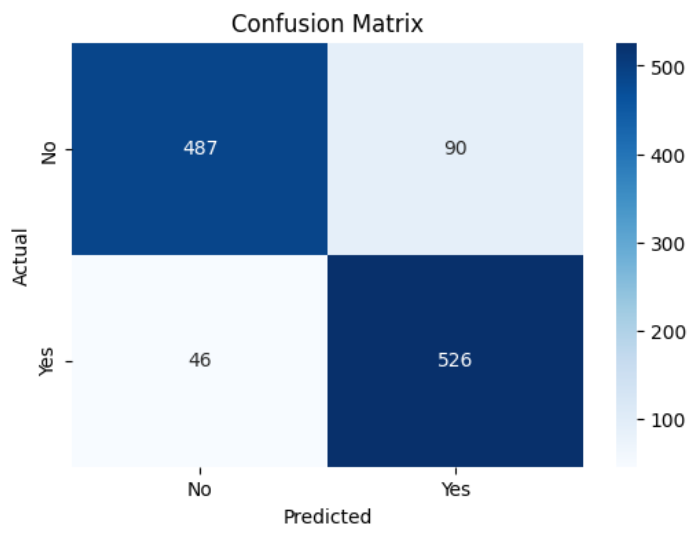
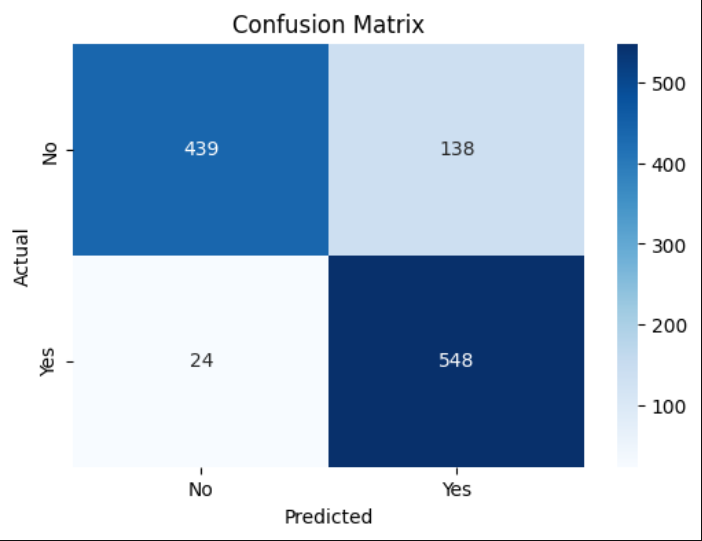

# Heart-Disease-Analysis

# About
This project seeks to analyze the data collected from the Framingham Heart Disease Study, and to train a classification model that will aid in the prediction of a patient's 10 year risk of developing heart disease.

The Framingham Heart Study (FHS) was commissioned by the United States Public Health Service in 1948 to identify risk factors associated with the development of coronary heart disease. It has several features on over 4,000 patients including their gender, cigarette use, cholesterol, BMI, glucose level, age, blood pressure, and more. 

# EDA
The project begins with an exploratory data analysis stage, which presents a detailed summary of what the study tells us, what relationships exist, what features are relevant for prediction, and what we must do to get the data ready for modeling. It was noted that the target feature (10 year CHD risk) was very imbalanced, and that there was a large quantity of missing values. Additionally, multicollinearity was noticed between some features (diastolic and systolic blood pressure, glucose and diabetes) which presented opportunities for dimensionality reduction and feature engineering in the subsequent stage.

# Preprocessing
The preprocessing stage takes what we learned from the exploratory data analysis, and prepares the data for modeling. This practice helps to ensure that the predictions are reliable, which is of even greater concern in this case since we seek to predict medical outcomes. Here, systolic and diastolic blood pressure was combined into mean arterial pressure, outliers were handled using an upper limit (a value constituting an emergency), missing values were imputed using KNN and simple approaches, and the dataset was rebalanced using SMOTENC. 

# Modeling
With the dataset preprocessed into two separate files using the different imputation techniques, a smattering of models were tested. The testing began with models that are resilient to scaling, since this dataset uses a composition of both categorical and continuous variables. These models included XGBoost, Random Forest, and Gradient Boosting. The greatest performance was found using Random Forest, whose results stood as the best for both imputation techniques. Models that are sensitive to scaling were tested as well, with the continuous features scaled using Standard Scaler. These models drastically underperformed the aforementioned ones. 

The Random Forest model attained an ROC-AUC score of 0.94 in the cross validation, and a test recall of 0.92. In the confusion matrix, it made 48 false negatives and 484 true negatives. This fact is important to consider because, when making medical predictions, false negatives are very costly.

# Tuning
While the model's performance is quite good, it could do with some optimization. RandomizedSearchCV was employed to tune the model's hyperparameters, which led to negligible gains in performance. It was then decided that the likelihood of the model making a false negative prediction was too high, so a probability threshold of 0.43 was chosen so as to decrease the chance of predicting a false negative, at the risk of increasing the number of false positives.

This new probability threshold yielded 24 false negatives and 138 false positives.

Confusion matrix (before probability threshold is used)

Confusion matrix (after probability threshold (0.43) is used)
